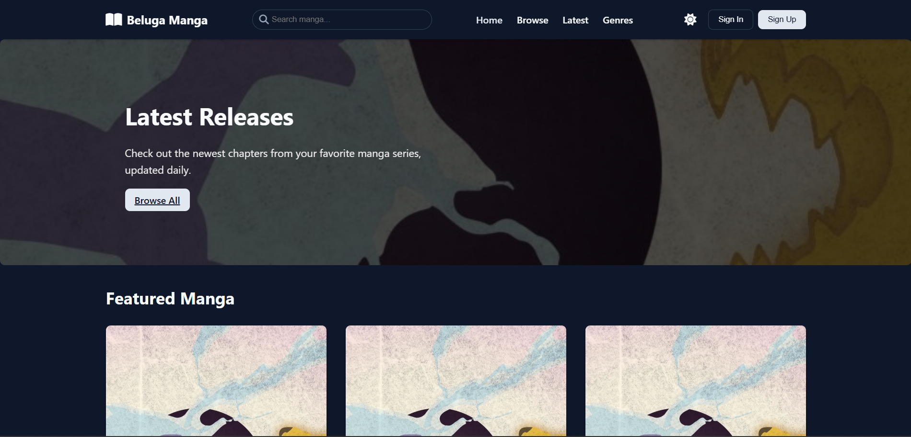

# MangaVerse (Beluga Manga)

A sleek, responsive manga reader website that allows users to browse, search, and read manga online with both vertical and horizontal reading modes.



## Features

- **Clean, Modern UI**: Intuitive interface with dark/light theme toggle
- **Manga Browser**: Filter manga by genre, status, and year
- **Reading Experience**: 
  - Vertical scrolling mode
  - Horizontal page-by-page mode
  - On-screen controls and keyboard navigation
- **Responsive Design**: Works on desktop, tablet, and mobile devices
- **Detailed Manga Pages**: Cover art, description, genres, chapters list
- **Static Implementation**: No backend required, all data is hardcoded

## Technologies Used

- HTML5
- CSS3 (with modern features like CSS variables and flexbox)
- JavaScript (ES6+)
- Font Awesome for icons
- Docker for containerization

## Installation

### Standard Method

1. Clone the repository:
   ```bash
   git clone https://github.com/yourusername/mangaverse.git
   cd mangaverse
   ```

2. Open `index.html` in your browser

### Using Docker

1. Build the Docker image:
   ```bash
   docker build -t beluga_manga:latest .
   ```

2. Run the container:
   ```bash
   docker run -d -p 5050:80 beluga_manga:latest
   ```

3. Access the website at:
   ```
   http://localhost:5050
   ```

## Project Structure

```
BelugaManga/
├── css/
│   ├── style.css        # Main stylesheet
│   └── reader.css       # Reader-specific styles
├── js/
│   ├── manga-data.js    # Hardcoded manga data
│   ├── main.js          # General website functionality
│   ├── reader.js        # Reading functionality
│   └── theme.js         # Theme switching
├── img/
│   ├── placeholder.png  # Placeholder for manga covers
│   └── favicon.ico      # Website favicon
│   └── favicon.png      # Website favicon
│   └── logo.svg         # Website logo
│   └── apple-touch-icon.png
│   └── screenshot.png
├── index.html           # Homepage
├── browse.html          # Manga browsing page
├── manga.html           # Individual manga details page
├── reader.html          # Manga reader page
├── Dockerfile           # For Docker deployment
└── README.md            # This file
```

## Usage

1. **Browse Manga**: Navigate through the collection on the browse page
2. **Manga Details**: Click on any manga cover to see its details
3. **Start Reading**: Click "Read Chapter" to open the reader
4. **Reading Controls**:
   - Toggle between vertical/horizontal reading modes
   - Use on-screen buttons or keyboard arrows to navigate
   - Click anywhere to toggle reading controls

## Docker Commands

```bash
# Build the Docker image
docker build -t beluga_manga:latest .

# Run the container
docker run -d -p 5050:80 beluga_manga:latest

# Stop the container
docker ps
docker stop [CONTAINER_ID]

# Remove the container
docker rm [CONTAINER_ID]
```

## Credits

- Developed by [Unknown](https://github.com/Unknown-086)
- Icons are themed on [Beluga](https://www.youtube.com/@Beluga1)

---

*This project is for educational purposes only and doesn't host any real manga content.*